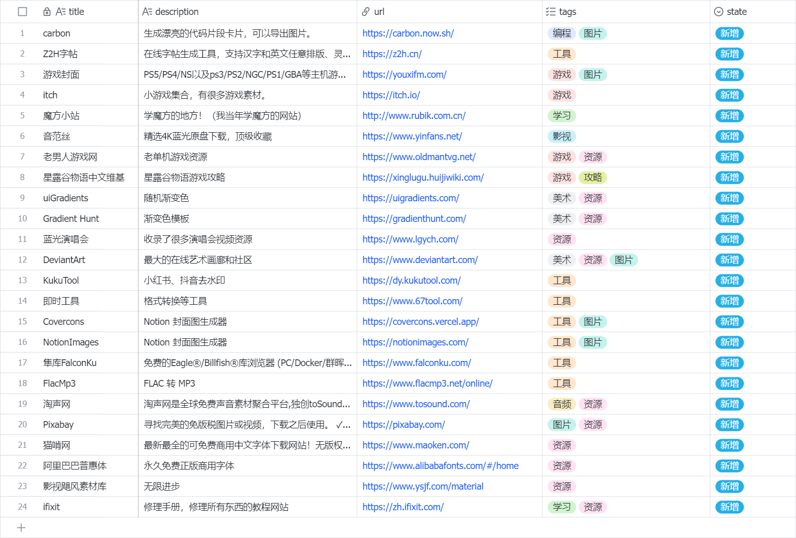

  

<h1 align="center">
 XGWebSite-Awesome 
</h1>

    <samp>
        一个极简风格(性冷淡风)的精选网站收藏集。
    </samp>

 

 

本项目是个人学习项目。（干中学）
主要给我练习 React 和 Next 以及 Supabase 数据库 和 Vercel 部署。

> ps: 其实我是Vue入门的。但是！React也是得了解的嘛~ 工具没有好坏，都要学！

## 🛠️ 技术栈

 

- **框架**: [Next.js 16](https://nextjs.org/) 
- **语言**: [TypeScript](https://www.typescriptlang.org/)
- **样式**: [Tailwind CSS](https://tailwindcss.com/) + [Shadcn UI](https://ui.shadcn.com/)
- **图标**: [Lucide React](https://lucide.dev/)
- **数据**: [Supabase](https://supabase.com/)
- **部署**: [Vercel](https://vercel.com/)

## 🍕 数据存放 and 增删改查 

目前，网站数据和图片都存放 Supabase 中。

- 在 Supabase 表数据是 👇 (图片名称是和 `title` 一致的)
 
| 字段名 | 说明 | 类型/备注 |
| :--- | :--- | :--- |
| `id` | ID自增 | uuid，唯一且随机 |
| `title` | 网站标题 | text，唯一且必有 |
| `description` | 网站描述 | text |
| `url` | 网站链接 | text |
| `image_url` | 网站Logo图片链接 | text |
| `tags` | 网站标签 | text[] |
| `is_favorite` | 是否收藏 | bool |
| `created_at` | 创建时间 | timestamptz |
 

### ✒️ 默认记录方式
默认收集记录网站信息的方式是用【飞书】或【Notion】等多维表格来记录。
这样的收集方式，很符合个人日常：就是拿个表来登记自己看到的或找到的有趣的网站。

### 1️⃣ 管理方法一：⭐⭐
从【飞书】导出CSV，手动或Py脚本的方式合并CSV
直接在项目下的json或csv文件中修改，图片也放在本项目里，不使用 supabase 。
- 优点：
  - 简单方便，无需写后台。
  - 可以直接在项目下修改，无需上传到 Supabase。
- 缺点：
  - 每次增删改查都需要push项目到github，才会在vercel上更新。
  - 练习不到 supabase 的使用。

### 2️⃣ 管理方法二：⭐

#### 📁 NocoDB + ⚡ Supabase 

- 优点：
  - 可视化数据库，像操作多维表格一样，比Supabase方便一点，可以选中一列直接删除...
- 缺点：
  - NocoDB 新建的 `MultiSelect`(多选)字段，在 Supabase 会变成 `test`
  - Supabase 字段 `text[]` 去到 NocoDB 会变成 `Specific DB type`(我也不知道什么东西，反正不可编辑...)

> 👇【BUG】NocoDB 无法正确识别 PostgreSQL 里的 `text[]` 
[https://github.com/nocodb/nocodb/issues/11951](https://github.com/nocodb/nocodb/issues/11951)

并且在【Supabase】新增或更新字段，NocoDB 刷新不出元数据。

#### 📁 Budibase + ⚡ Supabase  

- 优点：同上
- 缺点：
  - 在 Budibase 新建的 `MultiSelect`(多选)字段，在 Supabase 会变成 `json` 
  - 在 Supabse 中的 `text[]` 去到 Budibase 中，会变成 `text` 类型。

无论 NocoDB 还是 Budibase ，在他们本身内设置的【多选】，只要重新导入都不会再次识别成【多选】。
并且只要约定俗成在多维表格记录，其实用这两个并没有方便多少.....

### 3️⃣ 管理方法三：⭐⭐⭐⭐

写一个后台管理系统，CSV导入批量上传。
- 优点：
  - 批量导入可以识别是否存在或需要修改，还可以批量上传图片。
  - 单条修改和新增都方便。
- 缺点：
  - 开发麻烦，使用得少。
  - 记录与管理可能会割裂，在后台修改某项属性，飞书上不会对应变换。

### 4️⃣ 管理方法四：⭐⭐⭐⭐

飞书记录 -> 导出CSV -> 用Python处理和上传。
只要注意图片名称和网站名称Title一致，这样图片的调用和上传都很方便~ 

在飞书里 可以这样记录👇(多加一个 state)
`title` | `description` | `url`  | `tags`  | `state`

1.  不用 `id` 和 `created_at` ，因为在 Supabase 会自动生成。
2.  `image_url` 也不要，脚本一键导入图片后，更新 Supabase 里对应图片名称的 `title` 那一行的 `image_url` 即可。
3.  `is_favorite` 也不要，默认 `false`
4.  只多了一列 【状态】，用来记录网站的状态（正常、新增、更新、删除）。
    1. 默认【新增】：因为每次收集都是新收集到的网站，都是新增的。
    2. 【更新】或【删除】通常都是单条或少数。
    3. 【正常】 跳过即可

- 优点：
  - 简单方便。
  - 统一在飞书管理，不割裂，
  - 可以批量导入，节省时间。
- 缺点：
  - 由于是导出到CSV，所以更新后需要手动在飞书更新一下【状态】

> **目前方案四最适合的，虽然没有一个后台，但是【飞书】在“随时登记”上更加方便。**
> 
> **统一一个地方来管理日常所登记到的信息，以飞书为准。**
> 
> **当然！需要约定俗成不要去 Supabase 改数据，否则 Supabase 上的数据会跟飞书不同步，有需要还是在飞书上直接标记状态为【更新】**

---
#### 飞书机器人 ⭐⭐⭐⭐⭐

创建飞书的管理机器人。可以直接读取并改写【飞书】里记录！
并且在更新完 Supabase 还可以更新飞书的状态。

这个以后测试.......

## 数据上传

scripts 目录下有个 sync.py 文件，用来上传数据到 Supabase。
设置好data.xlsx 文件，然后运行 sync.py 即可。

> 注意：
> 1. 运行前需要先安装 requirements.txt 里的依赖。
> 2. 运行前需要先设置好 .env.local 文件里的环境变量。
> 3. 运行前需要先设置好 data.xlsx 文件里的网站数据。

### 图片上传

script 目录下有个 upload_images.py 文件，用来上传图片到 Supabase。
要上传的图片放在 `images_upload` 目录下。上传完会自动归类到 `images_done` 目录下。

## 开发记录：
1. [x] [01-项目规划.md](notes/01-项目规划.md)
2. [x] [02-字体.md](notes/02-字体.md)
3. [x] [03-暗黑模式.md](notes/03-暗黑模式.md)
4. [x] [04-顶部导航栏.md](notes/04-顶部导航栏.md)
5. [x] [05-卡片.md](notes/05-卡片.md)
6. [x] [06-分类栏.md](notes/06-分类栏.md)
7. [x] [07-Supabse.md](notes/07-Supabse.md) 
8. [x] [08-Vercel.md](notes/08-Vercel.md) 
9. [x] [09-数据上传.md](notes/09-数据上传.md)
10. [x] [10-优化-空Logo.md](notes/10-优化-空Logo.md) 

## 参考：
- [LKs 网站推荐合集 - lkssite.vip](https://lkssite.vip/)
