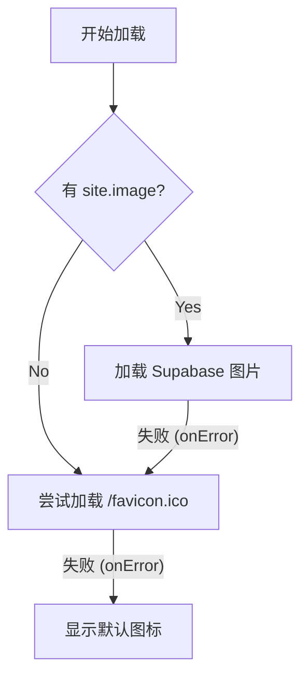

# 🎨 Vercel 风格网站构建教程：优化篇 (Logo 自动获取)

在展示网站列表时，如果每个网站都需要手动上传 Logo 图片，那工作量太大了。
我们希望实现一个智能的 Logo 加载策略：

1.  **优先显示**：你自己上传的精美 Logo (存在 Supabase)。
2.  **自动降级**：如果没有上传，尝试自动获取该网站的 `favicon.ico`。
3.  **最终兜底**：如果连 Favicon 都找不到（图片裂开），显示一个默认的图标（比如地球或文字首字母）。

---

## 🛠️ 实现思路

为了实现这个功能，我们需要把 `SiteCard` 变成一个 **Client Component** (客户端组件)，因为我们需要监听图片的 `onError` 事件来判断图片是否加载失败。

### 核心逻辑



---

## 🚀 代码实现

修改 `components/site-card.tsx`。

### 1. 引入必要的 Hook 和图标
我们需要 `useState` 来记录图片是否出错，以及 `lucide-react` 里的 `Globe` 图标作为兜底。

### 2. 获取 Favicon 的技巧
直接请求 `https://domain.com/favicon.ico` 有时候会遇到 404 或者跨域问题。
更稳妥的方式是使用 Google 的 Favicon 服务（或者 DuckDuckGo），它们提供了统一的 API：
`https://www.google.com/s2/favicons?domain={域名}&sz=128`

但既然你要求 "用 img 去获取源网站的 favicon.ico"，我们可以先尝试直接构造 URL，或者为了稳定性，我们结合两者。
*(采用 Google 服务方案，因为它是最稳定且不需要配置 Next.js 域名的)*

**注意**：如果我们直接用 `` 标签（小写的 HTML 标签）而不是 Next.js 的 `<Image />`，就不需要在 `next.config.ts` 里配置域名白名单了！这对展示外部不可控的 Favicon 非常有用。

---

## 📝 修改后的代码

```tsx
"use client"

import Image from "next/image"
import Link from "next/link"
import { Star, Globe } from "lucide-react"
import { useState } from "react"

import { Badge } from "@/components/ui/badge"
import {
    Card,
    CardDescription,
    CardFooter,
    CardHeader,
    CardTitle,
} from "@/components/ui/card"

export interface Site {
    id: string
    title: string
    description: string
    url: string
    image: string
    tags: string[]
    isFavorite: boolean
}

interface SiteCardProps {
    site: Site
}

export function SiteCard({ site }: SiteCardProps) {
    const [imageError, setImageError] = useState(false)

    // 提取域名用于获取 favicon
    const getFaviconUrl = (url: string) => {
        try {
            const domain = new URL(url).hostname
            // 使用 Google Favicon 服务 (稳定且支持 fallback)
            return `https://www.google.com/s2/favicons?domain=${domain}&sz=128`
        } catch {
            return ""
        }
    }

    return (
        <Link href={site.url} target="_blank" rel="noreferrer">
            <Card className="flex flex-col overflow-hidden border-border/40 bg-background/50 backdrop-blur-sm transition-all hover:shadow-2xl dark:hover:shadow-amber-50/5 dark:border-border/50 dark:shadow-border/50">
                <CardHeader className="p-5 pb-0 min-h-32">
                    <div className="flex items-center gap-3 mb-2">
                        <div className="relative shrink-0">
                            {/* 逻辑：有图且没报错 -> 显示图；否则 -> 显示 Favicon；Favicon 也裂了 -> onError 显示默认图标 */}
                            {!imageError ? (
                                <>
                                    {site.image ? (
                                        <Image
                                            src={site.image}
                                            alt={site.title}
                                            width={32}
                                            height={32}
                                            onError={() => setImageError(true)}
                                        />
                                    ) : (
                                        /* 如果没有 site.image，直接尝试显示 Favicon */
                                         {
                                                e.currentTarget.style.display = 'none';
                                                setImageError(true);
                                            }}
                                        />
                                    )}
                                </>
                            ) : (
                                /* 兜底：显示默认图标 */
                                <Globe className="w-6 h-6 text-muted-foreground/50" />
                            )}
                        </div>
                        
                        <CardTitle className="flex-1 min-w-0 line-clamp-1 text-base font-semibold tracking-tight text-foreground">
                            {site.title}
                        </CardTitle>

                        {/* 收藏按钮 */}
                        <Star className={site.isFavorite ? "fill-yellow-400 stroke-yellow-400" : "stroke-muted-foreground/50"} />
                    </div>

                    <CardDescription className="line-clamp-2 text-sm leading-relaxed text-muted-foreground/80" title={site.description}>
                        {site.description}
                    </CardDescription>
                </CardHeader>

                <CardFooter className="p-4 pt-0 ">
                    <div className="flex flex-wrap gap-2 h-6 overflow-hidden">
                        {site.tags.map((tag) => (
                            <Badge key={tag} variant="secondary" className="text-xs font-normal">
                                {tag}
                            </Badge>
                        ))}
                    </div>
                </CardFooter>
            </Card>
        </Link >
    )
}
```
